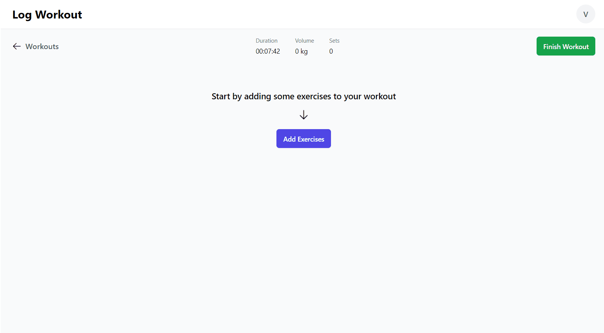

# 💪 Workout Tracker

Welcome to Workout Tracker, the ultimate workout tracking solution designed to revolutionize your fitness journey.

_Live Demo https://workouttrackerapp.vercel.app/_

_Backend https://github.com/PrVille/Workout-tracker-backend_

## 🚀 Features

- Log workouts, sets, reps, and weights
- Access a library of exercises
- Create your own custom exercises
- Visualize your achievements with detailed charts and graphs
- Calculators for 1RM and warmup sets
- & more to come

## 🔧 Technologies & Tools

    
      
    
      
    
    
    

## 👤 Author [🔝](#-dev-tools)

👋 **Ville Prami**

    
     
     
    

